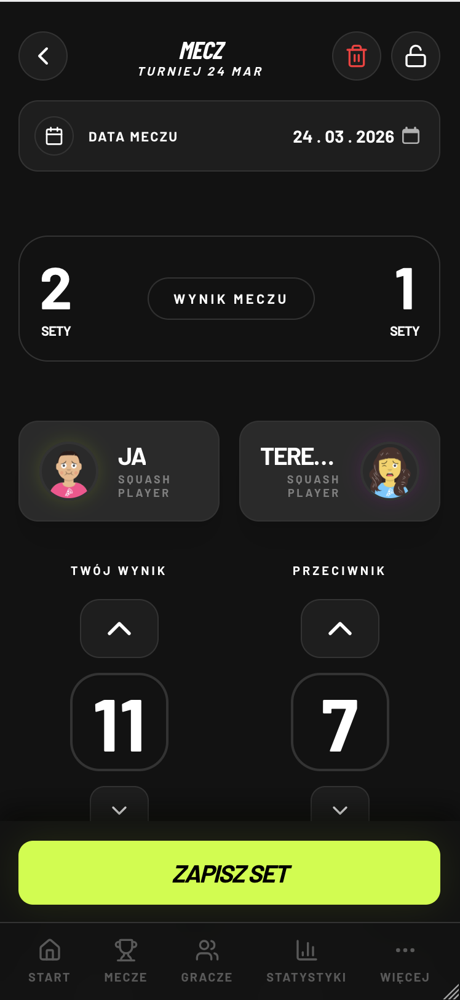
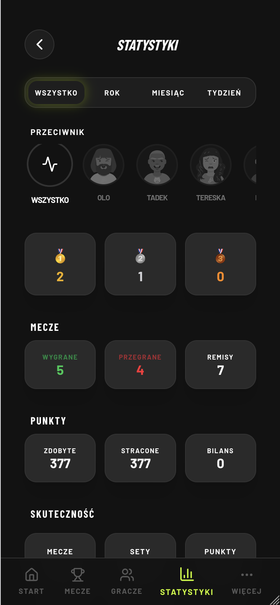
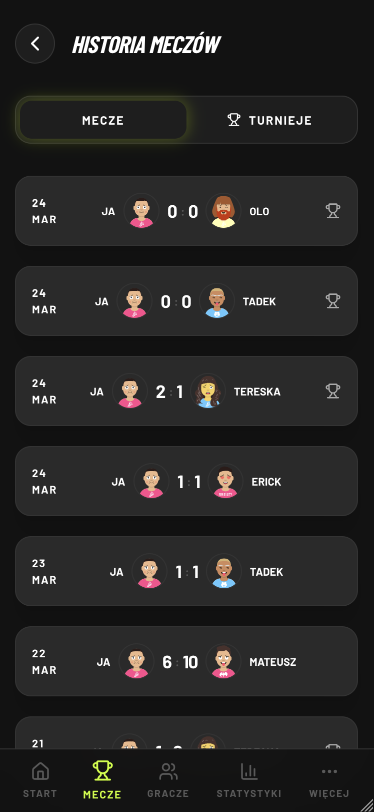
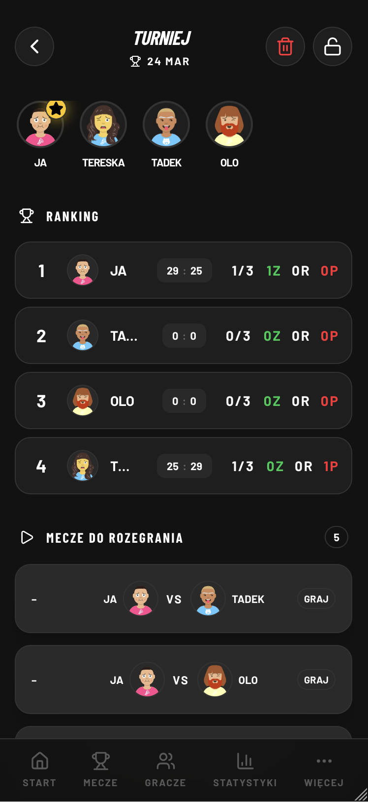

# What's The Score? 🎾

[🇺🇸 English Version](#english-version) | [🇵🇱 Wersja Polska](#wersja-polska)

---

## 🇵🇱 Wersja Polska

**What's The Score?** to nowoczesna, prosta i wygodna aplikacja internetowa (PWA) przeznaczona do rejestrowania i śledzenia wyników w squasha. Pomaga organizować prywatne rozgrywki, śledzić własne postępy i zarządzać turniejami, pozwalając skupić się na grze, a nie na matematyce.

### Główne funkcje

*   **Rejestrowanie Meczów:** Odtwarzaj punktację w czasie rzeczywistym. Aplikacja dba o zasady (np. gra na przewagi, limit punktów).
*   **Historia Gier:** Zapisuj swoje mecze i wracaj do poprzednich wyników, by zobaczyć jak poszło wczoraj czy tydzień temu.
*   **Tryb Turniejowy:** Organizuj i rozpisuj turnieje, ułatwiając układanie drabinek i zliczanie wyników dla wielu graczy.
*   **Szczegółowe Statystyki:** System generuje wykresy oraz zestawienia Head-to-Head (H2H), dzięki którym wyłapiesz swoje najsłabsze i najmocniejsze strony w starciach z określonymi sparingpartnerami.
*   **Aplikacja PWA:** Możesz dodać What's The Score? do ekranu głównego swojego telefonu i korzystać z niej jak z natywnej aplikacji - szybciej i bez paska przeglądarki.
*   **Lista Graczy:** Zarządzaj swoimi ulubionymi przeciwnikami - dodawaj nowych sparingpartnerów bez konieczności zakładania przez nich własnych kont kont.

### Zrzuty ekranu

Poniżej znajduje się wizualizacja głównych ekranów aplikacji.

  
  
  
  

### Jak zagrać pierwszy mecz?

1.  **Dodaj gracza:** Przejdź do zakładki *Gracze* i stwórz profil swojego dzisiejszego przeciwnika, albo dodaj go tuż przed samym meczem.
2.  **Rozpocznij Grę:** W dolnym menu wybierz ikonę plusa, by wystartować. System zaprezentuje kort – wystarczy, że przypiszesz graczy na odpowiednie połówki.
3.  **Punktuj:** Wystarczy dotykać połowy kortu gracza, który właśnie wygrał wymianę. Aplikacja zliczy wynik i podpowie kto i z jakiej strony serwuje.
4.  **Zapisz:** Gemy zapisują się automatycznie na koncie użytkownika.

### Instalacja (PWA) na telefonie

Nie znajdziesz nas w App Store czy Google Play – jesteśmy nowocześniejsi.
*   **iOS / Safari:** Będąc na naszej stronie, kliknij ikonę "Udostępnij" (środek dolnego paska) i wybierz opcję "Do ekranu początk.". Gotowe!
*   **Android / Chrome:** Dotknij w ikonę menu (trzy kropki) w prawym górnym rogu przeglądarki i wybierz "Dodaj do ekranu głównego".

---

## 🇺🇸 English Version

**What's The Score?** is a modern, simple, and convenient Progressive Web Application (PWA) designed to track and record squash match scores. It helps you manage private matches, track your progress, and run mini-tournaments, allowing you to focus on the game itself, not just the math.

### Key Features

*   **Match Scoring:** Track match scoring in real-time. The application enforces common squash rules (e.g., tie-breaks, target scores).
*   **Match History:** Save your games and revisit old results to see exactly how well you did last week.
*   **Tournament Mode:** Organize brackets and manage scores seamlessly for larger groups of players.
*   **In-Depth Statistics:** The system provides progress charts and Head-to-Head (H2H) performance breakdowns to help you analyze your gameplay against specific opponents.
*   **PWA Experience:** Add "What's The Score?" to your phone's home screen and use it exactly like a native app—faster loading and no distracting browser UI.
*   **Player List:** Manage your regular sparring partners—add virtual players instantly without requiring them to create an account.

### Screenshots

Below is a visualization of the main application screens.

  
  
  
  

### How to play your first match?

1.  **Add a Player:** Go to the *Players* tab and create a profile for your opponent.
2.  **Start a Match:** Tap the big plus icon in the bottom menu. The system will prompt you a court layout—just assign the players to the left and right sides.
3.  **Score Points:** Simply tap on the court half belonging to the player who won the rally. The app handles the point tracking and serving sides.
4.  **Save:** Completed games are automatically synced and saved to your history.

### How to install (PWA) on your phone

You won't find us in the App Store or Google Play—we're directly accessible from your browser.
*   **iOS / Safari:** Tap the "Share" icon (middle of the bottom menu bar) and select "Add to Home Screen". Done!
*   **Android / Chrome:** Open the browser menu (three dots in the top right corner) and tap "Add to Home screen".

---

*Contact: marcin@softem.pl*
